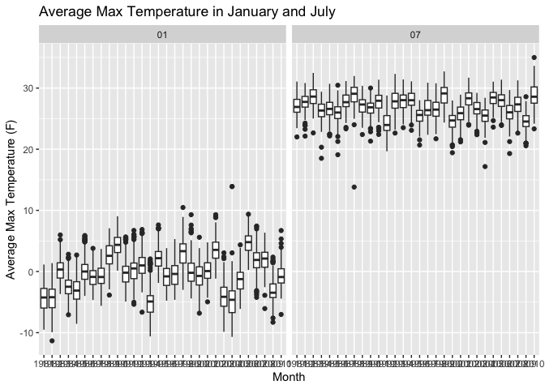

p8105_hw3_SL5454
================
2024-10-10

Dataset description: This dataset shows some of the weather data in New
York, including the date of collection, maximum and minimum temperature,
total daily precipitation, snowfall, and snow depth. The structure of
the dataset includes rows for each date of collection, with columns for
each of the weather measurements. The dataset spans the period from
January 1981 through December 2010 and contains approximately 2.6
million records. When attempting to predict trends in these
measurements, missing values in precipitation, snowfall, and snow depth
may affect the results of the analysis.

``` r
ny_weather = ny_noaa |>
  janitor::clean_names() |>
  separate(date, into = c("year", "month", "day"), sep = "-") |>
  mutate(tmax = as.numeric(tmax),
         tmin = as.numeric(tmin),
         tmin_celsius = tmin / 10,
         tmax_celsius = tmax / 10,
         prcp_mm = prcp / 10)

snowfall = ny_weather |>
  count(snow) |>
  arrange(desc(n))
```

The most common observed value is 0, because many days likely have no
snowfall.

``` r
ny_weather |>
  filter(month == c("01", "07")) |>
  group_by(id, year, month) |>
  summarise(avg_tmax = mean(tmax_celsius, na.rm = TRUE)) |>
  ungroup() |>
  ggplot(aes(x = year, y = avg_tmax)) +
  geom_boxplot() +
  facet_wrap(~ month) +
  labs(title = "Average Max Temperature in January and July",
       x = "Month", y = "Average Max Temperature (F)") 
```

    ## `summarise()` has grouped output by 'id', 'year'. You can override using the
    ## `.groups` argument.

    ## Warning: Removed 5972 rows containing non-finite outside the scale range
    ## (`stat_boxplot()`).

<!-- --> In
Janurary 2004, there were 2 outliers, showing an unusual high maximum
temperature. In July 1988, there were one outlier, showing an usual low
maximum temperature.

Make a two-panel plot showing the average max temperature in January and
in July in each station across years. Is there any observable /
interpretable structure? Any outliers? Make a two-panel plot showing (i)
tmax vs tmin for the full dataset (note that a scatterplot may not be
the best option); and (ii) make a plot showing the distribution of
snowfall values greater than 0 and less than 100 separately by year.
