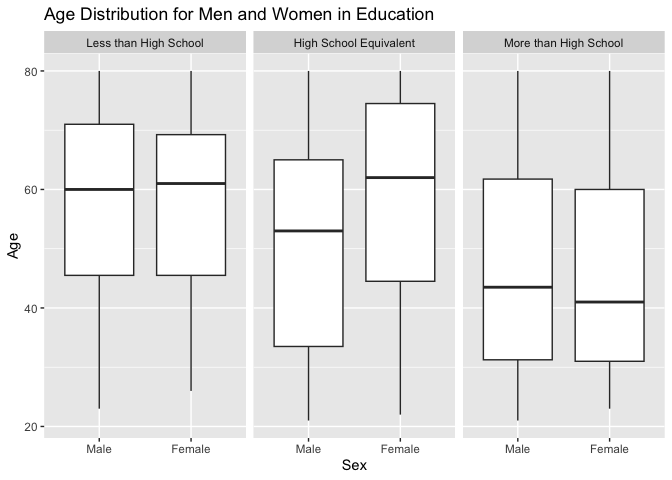

p8105_hw3_SL5454
================
2024-10-10

## Problem 1

``` r
library(p8105.datasets)
data("ny_noaa")
```

Dataset description: This dataset shows some of the weather data in New
York, including the date of collection, maximum and minimum temperature,
total daily precipitation, snowfall, and snow depth. The structure of
the dataset includes rows for each date of collection, with columns for
each of the weather measurements. The dataset spans the period from
January 1981 through December 2010 and contains approximately 2.6
million records. When attempting to predict trends in these
measurements, missing values in precipitation, snowfall, and snow depth
may affect the results of the analysis.

``` r
summary(ny_noaa)
```

    ##       id                 date                 prcp               snow       
    ##  Length:2595176     Min.   :1981-01-01   Min.   :    0.00   Min.   :  -13   
    ##  Class :character   1st Qu.:1988-11-29   1st Qu.:    0.00   1st Qu.:    0   
    ##  Mode  :character   Median :1997-01-21   Median :    0.00   Median :    0   
    ##                     Mean   :1997-01-01   Mean   :   29.82   Mean   :    5   
    ##                     3rd Qu.:2005-09-01   3rd Qu.:   23.00   3rd Qu.:    0   
    ##                     Max.   :2010-12-31   Max.   :22860.00   Max.   :10160   
    ##                                          NA's   :145838     NA's   :381221  
    ##       snwd            tmax               tmin          
    ##  Min.   :   0.0   Length:2595176     Length:2595176    
    ##  1st Qu.:   0.0   Class :character   Class :character  
    ##  Median :   0.0   Mode  :character   Mode  :character  
    ##  Mean   :  37.3                                        
    ##  3rd Qu.:   0.0                                        
    ##  Max.   :9195.0                                        
    ##  NA's   :591786

``` r
ny_weather = ny_noaa |>
  janitor::clean_names() |>
  separate(date, into = c("year", "month", "day"), sep = "-") |>
  mutate(
    year = as.numeric(year),
    month = as.numeric(month),
    day = as.numeric(day),
    tmax = as.numeric(tmax),
    tmin = as.numeric(tmin),
    tmin_celsius = tmin / 10,
    tmax_celsius = tmax / 10,
    prcp_mm = prcp / 10)

ny_weather |>
  count(snow) |>
  arrange(desc(n)) |>
  head(n = 3)
```

    ## # A tibble: 3 × 2
    ##    snow       n
    ##   <int>   <int>
    ## 1     0 2008508
    ## 2    NA  381221
    ## 3    25   31022

The most common observed value is 0, because many days likely have no
snowfall.

The two-panel plot showing the average max temperature in January and in
July in each station across years.

``` r
ny_weather |>
  filter(month == c("1", "7")) |>
  group_by(id, year, month) |>
  summarise(avg_tmax = mean(tmax_celsius, na.rm = TRUE)) |>
  ungroup() |>
  ggplot(aes(x = year, y = avg_tmax)) +
  geom_point() +
  facet_wrap(~ month) +
  labs(title = "Average Max Temperature in January and July",
       x = "Month", y = "Average Max Temperature (C)") 
```

    ## `summarise()` has grouped output by 'id', 'year'. You can override using the
    ## `.groups` argument.

    ## Warning: Removed 5972 rows containing missing values or values outside the scale range
    ## (`geom_point()`).

<!-- --> In
Janurary 2004, there were 2 outliers, showing an unusual high maximum
temperature. In July 1988, there were 1 outlier, showing an usual low
maximum temperature. The average maximum temperature in July didn’t
change much across the year. On the contrary, the maximum temperature in
Janurary went up and down across years.

1)  tmax vs tmin for the full dataset

``` r
ny_weather |>
  filter(!is.na(tmin) & !is.na(tmax)) |>
  ggplot(aes(x = tmin, y = tmax)) +
  geom_hex() +
  labs(title = "Max Temperature vs Min Temperature",
    x = "Min Temperature (C)", y = "Max Temperature (C)") +
  theme_minimal()
```

<!-- -->
(ii) The distribution of snowfall values greater than 0 and less than
100 separately by year

``` r
ny_weather|>
  filter(snow > '0' & snow < '100') |>
  ggplot(aes(x = year, y = snow)) + 
  geom_violin(alpha = 0.3) +
  labs(title = "Distribution of Snowfall Values (0, 100) by Year",
       y = "Snowfall", x = "Years") 
```

<!-- -->

## Problem 2

``` r
accelv = read_csv(file = "./data/nhanes_accel.csv",
                  na = c("NA", "", ".")) |>
  janitor::clean_names()
```

    ## Rows: 250 Columns: 1441
    ## ── Column specification ────────────────────────────────────────────────────────
    ## Delimiter: ","
    ## dbl (1441): SEQN, min1, min2, min3, min4, min5, min6, min7, min8, min9, min1...
    ## 
    ## ℹ Use `spec()` to retrieve the full column specification for this data.
    ## ℹ Specify the column types or set `show_col_types = FALSE` to quiet this message.

``` r
demo = read_csv(
  file = "./data/nhanes_covar.csv",
  na = c("NA", "", "."), 
  skip = 4) |>
  janitor::clean_names() |>
  filter(age >= '21' & !is.na(education) & !is.na(bmi))
```

    ## Rows: 250 Columns: 5
    ## ── Column specification ────────────────────────────────────────────────────────
    ## Delimiter: ","
    ## dbl (5): SEQN, sex, age, BMI, education
    ## 
    ## ℹ Use `spec()` to retrieve the full column specification for this data.
    ## ℹ Specify the column types or set `show_col_types = FALSE` to quiet this message.

``` r
all_data = 
  left_join(demo, accelv, by = "seqn") |>
  mutate(sex = factor(sex, levels = c(1, 2), labels = c("Male", "Female")),
         education = factor(education, levels = 1:3, labels = c("Less than High School", 
                                                                "High School Equivalent", 
                                                                "More than High School"))) 
```

The table for sex distribution in each education category, and the graph
for age distribution in each education category.

``` r
all_data |>
  group_by(sex, education) |>
  summarize(count = n()) |>
  ungroup() |>
  pivot_wider(
    names_from = 'sex',
    values_from = 'count'
  ) |>
  knitr::kable()
```

    ## `summarise()` has grouped output by 'sex'. You can override using the `.groups`
    ## argument.

| education              | Male | Female |
|:-----------------------|-----:|-------:|
| Less than High School  |   27 |     28 |
| High School Equivalent |   35 |     23 |
| More than High School  |   56 |     59 |

``` r
all_data|>
  ggplot(aes(x = sex, y = age)) +
  geom_boxplot() +
  facet_wrap(~education) +
  labs(
    title =  "Age Distribution for Men and Women in Education",
    x = "Sex",
    y = "Age"
  )
```

<!-- -->
Almost half of the women and men received education more than high
school. Those people usually has a smaller median age comparing to other
groups. There are more men than women in the group with high school
equivalent education. In addition, in this group, men tend to be
educated at a younger age than women.

Graph: Total activity vs age by sex and education level

``` r
data_clean = all_data |>
  pivot_longer(
    cols = min1:min1440,
    names_to = "min",
    names_prefix = "min", 
    values_to = "activity"
  ) |>
  mutate(min = as.numeric(min))

data_clean |>
  group_by(seqn, age, sex, education) |>
  summarise(total_activity = sum(activity, na.rm = TRUE)) |>
  ungroup() |>
  ggplot(aes(x = age, y = total_activity, color = sex)) +
  geom_point() +                 
  geom_smooth() + 
  facet_wrap(~ education) +                  
  labs(title = "Total Activity and Age Trend by Sex and Education Level",
       x = "Age",
       y = "Total Activity") +
  theme_minimal()
```

    ## `summarise()` has grouped output by 'seqn', 'age', 'sex'. You can override
    ## using the `.groups` argument.
    ## `geom_smooth()` using method = 'loess' and formula = 'y ~ x'

<!-- --> In
general, the total value of activity is greater for women than for men
at all ages with high school equivalent and more than high school
education. In less than high school education group, men have more total
activity than women after ago of 40.

``` r
data_clean |>
  mutate(hour = min / 60) |>
  group_by(sex, education, hour) |>
  summarize(mean_activity = mean(activity, na.rm = TRUE)) |>
  ggplot(aes(x = hour, y = mean_activity, color = sex)) +
  geom_point(alpha = 0.3) +
  geom_smooth() +
  facet_wrap(~ education, nrow = 3) +
  labs(title = "24-Hour Activity Time Course by Education and Sex",
       x = "Time of Day (hours)", y = "Mean Activity") 
```

    ## `summarise()` has grouped output by 'sex', 'education'. You can override using
    ## the `.groups` argument.
    ## `geom_smooth()` using method = 'gam' and formula = 'y ~ s(x, bs = "cs")'

<!-- -->
Most people’s activity levels increase dramatically from 5am to 10am.
Across all levels of education, women are typically more active than men
in the middle of the day.

## Problem 3

``` r
Jan2020 = read_csv(file = "./data/citibike/Jan 2020 Citi.csv",
                  na = c("NA", "", ".")) |>
  janitor::clean_names() |>
  mutate(year = "2020", month = "January")
```

    ## Rows: 12420 Columns: 7
    ## ── Column specification ────────────────────────────────────────────────────────
    ## Delimiter: ","
    ## chr (6): ride_id, rideable_type, weekdays, start_station_name, end_station_n...
    ## dbl (1): duration
    ## 
    ## ℹ Use `spec()` to retrieve the full column specification for this data.
    ## ℹ Specify the column types or set `show_col_types = FALSE` to quiet this message.

``` r
July2020 = read_csv(file = "./data/citibike/July 2020 Citi.csv",
                  na = c("NA", "", ".")) |>
  janitor::clean_names() |>
  mutate(year = "2020", month = "July")
```

    ## Rows: 21048 Columns: 7
    ## ── Column specification ────────────────────────────────────────────────────────
    ## Delimiter: ","
    ## chr (6): ride_id, rideable_type, weekdays, start_station_name, end_station_n...
    ## dbl (1): duration
    ## 
    ## ℹ Use `spec()` to retrieve the full column specification for this data.
    ## ℹ Specify the column types or set `show_col_types = FALSE` to quiet this message.

``` r
Jan2024 = read_csv(file = "./data/citibike/Jan 2024 Citi.csv",
                  na = c("NA", "", ".")) |>
  janitor::clean_names() |>
  mutate(year = "2024", month = "January")
```

    ## Rows: 18861 Columns: 7
    ## ── Column specification ────────────────────────────────────────────────────────
    ## Delimiter: ","
    ## chr (6): ride_id, rideable_type, weekdays, start_station_name, end_station_n...
    ## dbl (1): duration
    ## 
    ## ℹ Use `spec()` to retrieve the full column specification for this data.
    ## ℹ Specify the column types or set `show_col_types = FALSE` to quiet this message.

``` r
July2024 = read_csv(file = "./data/citibike/July 2024 Citi.csv",
                  na = c("NA", "", ".")) |>
  janitor::clean_names() |>
  mutate(year = "2024", month = "July")
```

    ## Rows: 47156 Columns: 7
    ## ── Column specification ────────────────────────────────────────────────────────
    ## Delimiter: ","
    ## chr (6): ride_id, rideable_type, weekdays, start_station_name, end_station_n...
    ## dbl (1): duration
    ## 
    ## ℹ Use `spec()` to retrieve the full column specification for this data.
    ## ℹ Specify the column types or set `show_col_types = FALSE` to quiet this message.

``` r
citibike <- bind_rows(Jan2020, July2020, Jan2024, July2024) |>
  mutate(
    weekdays = factor(weekdays, 
                      levels = c("Monday", "Tuesday", "Wednesday", "Thursday", "Friday", "Saturday", "Sunday")),
    member_casual = as.factor(member_casual),
    rideable_type = as.factor(rideable_type)
  )
```

Produce a reader-friendly table showing the total number of rides in
each combination of year and month separating casual riders and Citi
Bike members. Comment on these results.

``` r
citibike |>
  group_by(year, month, member_casual) |>
  summarise(total_rides = n()) |>
  ungroup() |>
  pivot_wider(
    names_from = member_casual, 
    values_from = total_rides) |>
  knitr::kable()
```

    ## `summarise()` has grouped output by 'year', 'month'. You can override using the
    ## `.groups` argument.

| year | month   | casual | member |
|:-----|:--------|-------:|-------:|
| 2020 | January |    984 |  11436 |
| 2020 | July    |   5637 |  15411 |
| 2024 | January |   2108 |  16753 |
| 2024 | July    |  10894 |  36262 |

Compared to 2020, the total number of people using the Citi bike in 2024
has doubled. In both 2020 and 2024, the number of people using Citi
bikes in July is more than in January, and the number of member is
larger than the number of casual.

The 5 most popular starting stations for July 2024

``` r
citibike |>
  filter(year == "2024", month == "July") |>
  count(start_station_name, sort = TRUE) |>
  top_n(5) |>
  knitr::kable()
```

    ## Selecting by n

| start_station_name       |   n |
|:-------------------------|----:|
| Pier 61 at Chelsea Piers | 163 |
| University Pl & E 14 St  | 155 |
| W 21 St & 6 Ave          | 152 |
| West St & Chambers St    | 150 |
| W 31 St & 7 Ave          | 146 |

Plot for median rider duration

``` r
citibike |>
  group_by(year, month, weekdays) |>
  summarise(median_duration = median(duration)) |>
  ungroup() |>
  ggplot(aes(x = weekdays, y = median_duration, color = year)) +
  geom_line(aes(group = year)) +
  facet_wrap(~ month) +
  labs(title = "Median Ride Duration by Weekdays, Month, and Year",
       x = "Weekdays", y = "Median Ride Duration") +
  theme_minimal() 
```

    ## `summarise()` has grouped output by 'year', 'month'. You can override using the
    ## `.groups` argument.

<!-- -->
The median rider duration is much longer in 2020. In both 2020 and 2024,
median ride duration is longer on weekends in July. In Janurary, median
ride duration is still longer in 2020, but not in 2024.

The impact of month, membership status, and bike type on the
distribution of ride duration.

``` r
citibike |>
  filter(year == 2024) |>
  group_by(month, member_casual, rideable_type) |>
  summarise(median_duration = median(duration)) |>
  ungroup() |>
  ggplot(aes(x = month, y = median_duration, fill = member_casual)) +
  geom_bar(stat = "identity", position = "dodge") +
  facet_wrap(~ rideable_type) +
  labs(title = "Impact of Month, Membership, and Bike Type on Ride Duration (2024)",
       x = "Month", y = "Median Ride Duration (mins)", fill = "Membership Status") +
  theme_minimal()
```

    ## `summarise()` has grouped output by 'month', 'member_casual'. You can override
    ## using the `.groups` argument.

<!-- --> In
general, those without memberships rode longer than those with
memberships. People with memberships spent a similar median amount of
time riding bicycles and riding e-bikes in January and July. Those
without memberships rode longer in July, preferring to ride classic
bikes.
